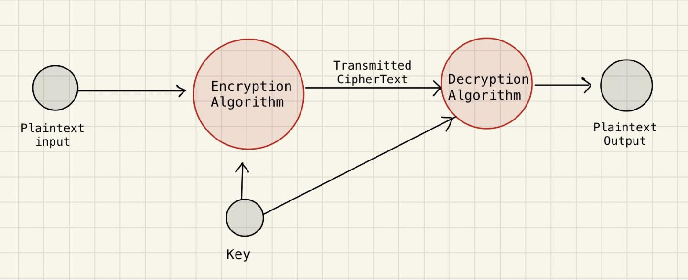

# Symmetric Ciphers 

 - Some basic terms and definations : 
 
   1. **Plain Text :** The original message or data that is to be encrypted.
   2. **Cipher Text :** The encrypted/modified message 
   3. **Key :**  unique key , used by sender and reciever to authorise the communication , and encrypt/decrypt the data.
   4. **Encryption Algorithm :** Algorithmic operations on the `plain text` to convert it into `Cipher Text`
   5. **Dencryption Algorithm :** Reverse of the Encryption Algorithm involves operations on the `Cipher Text` to convert it into `plain text` .

Basic Steps involved in Symmetric Cipher is :

- In symmetric ciphers most important consideration is to keep the key protected , as if the key is compromised , anyone could read/access the encrypted data .
- Any encryption algorithm is characterised by , it's Encryption and Decryption algorithms , the brief overview of how it works could be shown as :
  -   say we have a plaintext `X` , Encryption Algorithm `E` , Decryption Algorithm `D` and some key `K` for our cipher.
  
  **at source:**
    - transmitted_message = E(X,K)
  
  **at destination:**
    - X = D(transmitted_message,K)
  
- Basic assumption is that the encryption algorithm `E ` and the decryption algorithm `D` is known. Therefore for a strong encryption scheme it is essential that the key isnt accessible. 
- The key could be generated either at the transmission end and then transmitted to the destination through some secure channel or could be delivered to the source and destination , by some third party source.
 
- ## Caesar Cipher 
  
  - It is one of the most primitive type of encryption algorithm 
  - It involves the basic shift of the alphabets , by a constant factor , all the letters are displaced , such that it forms a cycle.
  - Algorithm :
    - ##### Encryption
      - Each character in the Alphabet is mapped to an integer , say for lowercase letters a -> 0 , b-> 1 ...... z-> 25 and similiarly for uppercase letters, rest of the symbols arent changed by the cipher algorithm.
      - Once this mapping is established , one could replace the alphabet mapped to some index **i** , with the one mapped with index **(i+K)%26**
      - Note that one could introduce any such substitution scheme like lower_case_alphabets being mapped to upper_case_alphabets and vice versa or , like mentioned above , which depends on the implementation.
    - ##### Decryption 
      - One could simply see from the fact that , say 
        we have j = (i+K)%26 , therefore for some integer L and some key K of the cipher , we can say , 

        i + K = L*26 + j , or simply , 

        i = L*26 + j - K , 

        as i is in range of 0 - 25 , 

        i % 26 = i = 0 + ( j - k ) % 26
         
      - This cipher is easily breakable , as there are effectively only 26 keys [0-25] available for the caesar cipher , as after performing the mod operation any random integer chosen as key falls into the range [0-25]. And hence , given the cipher text and the given message , one could simply generate the key for the given cipher system and hence , it doesnt provides for much of the protection.
      - **Scope for improvement** The number of possible keys that could be generated , could be increased from 26 to some large number , so that the key for the cipher isnt compromised easily.This could be achieved by using one or more of the following techinques :
       
        1. introducing monoalphabetic substitution : wherein one could define mapping such that any letter of the alphabet could be replaced by any other possible alphabet and hence there may exist upto **26!**  different keys ( or arrangments ) to be tried before cracking the key of the given cipher.
 
[ X ] Caesar-Cipher 

[ ] Cryptanalysis and statistical view point of the algorithms

  

